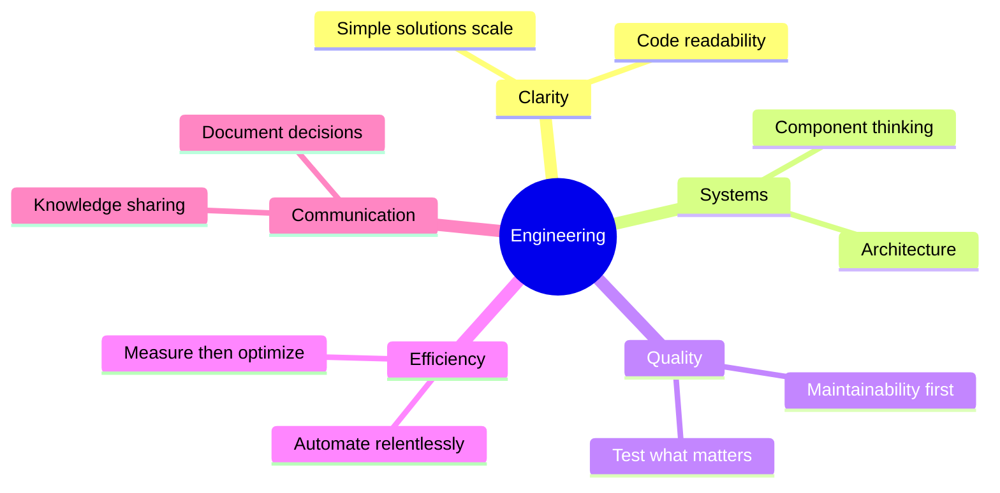

[animated-github-profile.md](https://github.com/user-attachments/files/25331033/animated-github-profile.md)
# 
🌌 Building systems that compound. 🌌

  

  

---

### 💫 About Me

I write code that **scales**, systems that **last**, and tools that **serve communities**. My work centers on sustainable architecture, deliberate design, and compounding value over time.

I don't chase frameworks. I understand fundamentals, recognize patterns, and build with intention. Every line serves a purpose. Every system has a reason.

**Open source isn't a side project—it's how I think about software.**

 

---

## 🚀 What I'm Building

<b>🏗️ Infrastructure for Long-Term Projects</b>

 

Systems designed for **durability**, not disposability. I focus on architecture that adapts without breaking, codebases that welcome contributors, and tools that solve real problems.

<b>🛠️ Developer Tooling</b>

 

Automation, CLI utilities, and libraries that remove friction. I build what I need, then polish it for others.

<b>🌐 Community-Driven Solutions</b>

 

Software that grows stronger with use. Built in public, maintained with discipline, improved through collaboration.

<b>🎨 3D Design & Visualization</b>

 

Creating immersive 3D experiences and models using Blender. Bringing ideas to life through visual storytelling and technical artistry.

---

## 🧭 Open Source Philosophy

I contribute to projects that **matter**. Not for stars or followers—for **impact**.

Good open source work requires more than code. It requires:
- 📚 Documentation that guides
- 🎯 Issues that teach
- ✅ Reviews that elevate
- 🔧 Maintenance that endures

**Sustainability beats velocity.** I'd rather ship once properly than iterate forever on shortcuts.

---

## ⚡ Engineering Principles

<table>
<tr>
<td width="50%">

**🎯 Code Quality**
- Clarity over cleverness
- Maintainability first
- Test what matters

**🧠 Thinking**
- Systems thinking
- Measure, then optimize
- Document decisions

</td>
<td width="50%">

**⚙️ Execution**
- Automate relentlessly
- Humans shouldn't do machine work
- Build for the long term

**📈 Growth**
- Learn through building
- Teach through writing
- Grow through feedback

</td>
</tr>
</table>

---

## 💻 Tech Stack

### **Languages**

### **Frontend**

### **Backend & Database**

### **DevOps & Cloud**

### **3D & Design**

### **Tools**

### **Currently Exploring**

---

## 📊 GitHub Analytics

---

## 🎯 Current Focus

Working on developer tooling that reduces cognitive load and increases consistency across teams. Building in the open. Documenting deeply. Contributing upstream where it matters.

**Learning through building.** **Teaching through writing.** **Growing through feedback.**

---

## 🏆 GitHub Trophies

---

## 📈 Contribution Graph

---

## 🐍 Contribution Snake

---

### 💭 Dev Quote

---

## 🌟 Let's Connect

---

### ⚡ "Execution compounds. Discipline scales. Systems endure."

